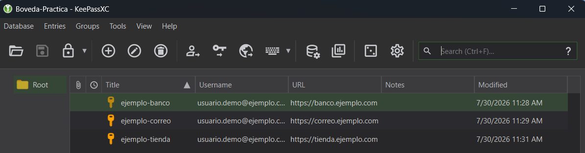
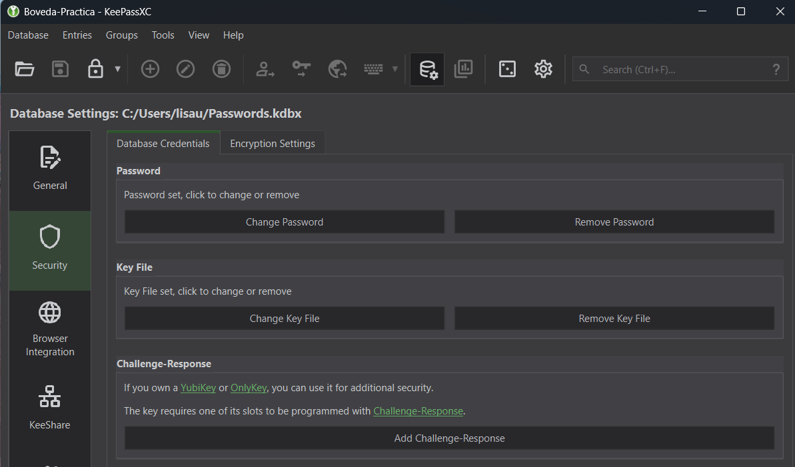
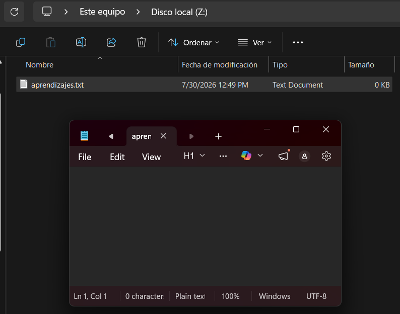

# Práctica: Mi Bóveda y Contenedor Seguro Fundamental

**Módulo:** Criptografía Práctica y Gestión de Identidad
**Unidad 1:** Gestión de identidad — bóvedas, MFA y Passkeys
**Autor:** Lisa Ubbenjans
**Fecha:** 30/07/2026

---

## 1. Objetivo

Construir un entorno de seguridad personal en dos capas complementarias:

1. **Capa de acceso**: una bóveda de credenciales cifrada, protegida con doble factor (contraseña maestra más archivo llave), que elimina la reutilización de contraseñas y el error humano al generarlas.
2. **Capa de datos en reposo**: un contenedor cifrado que mantiene los archivos sensibles inaccesibles incluso ante la pérdida física del equipo.

## 2. Entorno y herramientas

| Componente | Elección | Versión |
|---|---|---|
| Sistema operativo | Windows 11 (host) | — |
| Gestor de contraseñas | KeePassXC (local-first) | 2.7.12 |
| Cifrado de volúmenes | VeraCrypt | 1.26.29 |

**Justificación de KeePassXC frente a Bitwarden:** se optó por el modelo *local-first* frente a la sincronización en la nube. La base de datos `.kdbx` nunca abandona el equipo, por lo que la superficie de ataque no incluye servidores de terceros ni el riesgo de una brecha en el proveedor. El coste de esta decisión es que la responsabilidad del respaldo recae íntegramente en el usuario.

---

## 3. Parte 1: Configuración de la bóveda de identidad

### 3.1 Creación de la base de datos

Se creó la base de datos `Boveda-Practica.kdbx` con la configuración de cifrado por defecto:

- Algoritmo de cifrado: AES 256-bit
- Función de derivación de clave (KDF): Argon2d
- Iteraciones (rondas de transformación): 49
- Uso de memoria: 64 MiB
- Paralelismo: 4 hilos

**Justificación del formato KDBX 4:** solo este formato admite Argon2 como función de derivación de clave; KDBX 3 se limita a AES-KDF, que escala únicamente en iteraciones de CPU y por tanto es mucho más barato de atacar con hardware especializado.

**Justificación de Argon2d:** Argon2 es una KDF *memory-hard*, es decir, exige una cantidad significativa de memoria RAM por cada intento de derivación. Esto encarece enormemente los ataques de fuerza bruta paralelizados en GPU o ASIC, que son muy eficientes en cómputo pero están fuertemente limitados en memoria por núcleo.

Entre las dos variantes disponibles, Argon2d (acceso a memoria dependiente de los datos) maximiza la resistencia frente a fuerza bruta en GPU o ASIC, mientras que Argon2id es más resistente a ataques de canal lateral. Se mantuvo Argon2d, el valor por defecto de KeePassXC: un ataque de canal lateral exige que código hostil ya se esté ejecutando en la máquina, escenario en el que la base de datos estaría comprometida de todos modos. El escenario de amenaza realista es el robo del archivo `.kdbx` y su posterior crackeo offline, y frente a ese ataque Argon2d es la variante óptima.

### 3.2 Contraseña maestra

Se utilizó una frase de contraseña de varias palabras aleatorias combinadas con números y símbolos, en lugar de una contraseña corta y compleja.

**Justificación:** la resistencia de un secreto depende de su entropía, no de su apariencia de aleatoriedad. Una frase de varias palabras tomadas de un vocabulario amplio supera con holgura la entropía de una contraseña corta con sustituciones típicas, y además es memorizable, lo que evita el antipatrón de anotarla en un lugar inseguro.

### 3.3 Segundo factor: archivo llave (Key File)

Como protección adicional se añadió un archivo llave generado por KeePassXC. La base de datos solo se abre presentando ambos elementos: la contraseña maestra y el archivo llave.

**Ubicación:** el archivo llave se almacena deliberadamente separado del archivo `.kdbx`, en una carpeta distinta del equipo.

**Justificación:** esto materializa el principio de autenticación multifactor: combina *algo que sé* (la frase de contraseña) con *algo que tengo* (el archivo llave). Guardar ambos archivos en la misma carpeta anularía por completo la ventaja, ya que un atacante con acceso al sistema de archivos obtendría los dos factores en una sola operación.

> Riesgo asumido: la pérdida del archivo llave implica la pérdida irreversible de la base de datos. No existe mecanismo de recuperación.

**Verificación funcional del segundo factor:** al intentar desbloquear la base de datos únicamente con la contraseña maestra (sin el archivo llave), KeePassXC rechaza el acceso con el error *"Invalid credentials were provided... (HMAC mismatch)"*. Esto confirma que el archivo llave es obligatorio y no meramente decorativo: la verificación HMAC falla antes de que la base de datos llegue a descifrarse.

### 3.4 Carga de credenciales

Se crearon 3 registros de ejemplo utilizando el generador integrado, con longitud de 20 caracteres y las cuatro clases de caracteres activas (mayúsculas, minúsculas, números y símbolos):

| Registro | Usuario | URL |
|---|---|---|
| ejemplo-banco | usuario.demo@ejemplo.com | https://banco.ejemplo.com |
| ejemplo-correo | usuario.demo@ejemplo.com | https://correo.ejemplo.com |
| ejemplo-tienda | usuario.demo@ejemplo.com | https://tienda.ejemplo.com |

Todas las cuentas son ficticias y las contraseñas fueron generadas aleatoriamente; ninguna corresponde a un servicio real.



*Fig. 1 — Listado de registros de la bóveda. Solo se muestran títulos, usuarios y URLs; las contraseñas no son visibles en esta vista.*



*Fig. 2 — Panel de credenciales de la base de datos: la contraseña y el archivo llave están configurados simultáneamente ("Key File set, click to change or remove").*

---

## 4. Parte 2: Contenedor cifrado con VeraCrypt

### 4.1 Descarga verificada

VeraCrypt se instaló mediante `winget install IDRIX.VeraCrypt`. Este método descarga el instalador desde el repositorio oficial del proyecto y verifica automáticamente el hash del instalador antes de ejecutarlo, lo que ofrece una garantía de integridad equivalente a la verificación manual del hash SHA-256 publicado en la web oficial.

**Nota sobre la migración de dominio:** el dominio original de VeraCrypt, `veracrypt.fr`, redirige actualmente a `veracrypt.io`, tras la reubicación de su desarrollador principal. Un cambio de dominio en un proyecto de seguridad puede parecer, a primera vista, indistinguible de una toma de control maliciosa. La forma correcta de verificarlo no es confiar en la apariencia del dominio, sino en mecanismos criptográficos: la firma PGP del proyecto (huella digital `5069 A233 D55A 0EEB 174A 5FC3 821A CD02 680D 16DE`) se mantiene igual independientemente de dónde se aloje el sitio, y el hash verificado automáticamente por `winget` cumple ese mismo propósito.

### 4.2 Creación del volumen

| Parámetro | Valor |
|---|---|
| Tipo | Contenedor de archivo, volumen estándar |
| Archivo | `boveda_cifrada.hc` |
| Algoritmo de cifrado | AES |
| Función de derivación de clave | SHA512-PBKDF2 |
| Tamaño | 100 MB |
| Sistema de archivos | FAT |

**Comparación con la bóveda de KeePassXC:** VeraCrypt utiliza PBKDF2 como KDF, una función que escala únicamente en iteraciones de CPU y no exige memoria, a diferencia del Argon2d empleado en la bóveda. Esto ilustra que la elección de la KDF "óptima" depende del modelo de amenaza y del diseño de cada herramienta, no de un estándar universal.

**Protección contra capturas de pantalla:** desde la versión 1.26.24, VeraCrypt oculta su ventana ante cualquier intento de captura de pantalla o grabación, como defensa frente a herramientas como Windows Recall y a malware diseñado para exfiltrar credenciales mediante capturas. Para poder documentar este ejercicio fue necesario desactivar temporalmente esta protección desde `Settings > Performance / Driver Configuration`, lo cual requiere reiniciar el sistema para hacerse efectivo. Se trata de una decisión consciente: en un entorno de uso real, esta protección debería permanecer activa.

### 4.3 Recolección de entropía

Durante el formateo se movió el ratón de forma aleatoria dentro de la ventana durante aproximadamente 30 segundos.

**Justificación:** VeraCrypt utiliza las coordenadas del puntero como fuente de entropía adicional para alimentar su generador de números aleatorios. La calidad de la clave maestra depende directamente de la imprevisibilidad de esa semilla.

### 4.4 Montaje y uso

Se seleccionó la letra de unidad **Z:** en la ventana principal de VeraCrypt. Tras introducir la contraseña, el volumen se montó y apareció como unidad `Z:` en el Explorador de Windows. Dentro de la unidad se creó el archivo `aprendizajes.txt`. Al finalizar, se ejecutó **Dismount**, tras lo cual la unidad desapareció del sistema y el contenido volvió a ser un único archivo `.hc` indistinguible de datos aleatorios.

**Contraseña del contenedor:** se utilizó una frase de contraseña distinta a la de la bóveda, y se almacenó como un cuarto registro dentro de KeePassXC antes de desmontar el volumen. Reutilizar la contraseña maestra habría creado un único punto de fallo: comprometer un secreto habría abierto ambas capas de protección, anulando el beneficio de tener dos sistemas independientes.



*Fig. 3 — Volumen montado en la unidad Z:, con el archivo `boveda_cifrada.hc`, tamaño de 99 MiB y algoritmo AES visibles.*

---

## 5. Contenido de `aprendizajes.txt`

```text
1. La verificación de una fuente de descarga no depende del dominio, sino de mecanismos criptográficos (firma PGP, hash verificado por winget). Un cambio legítimo de dominio puede parecer sospechoso pero es verificable con las herramientas correctas.

2. La protección contra capturas de pantalla que VeraCrypt activa por defecto obliga a un trade-off consciente entre seguridad y documentación: hay que desactivarla temporalmente y reiniciar el sistema para poder generar evidencia visual del trabajo.

3. Cifrado en reposo (VeraCrypt) y gestión de accesos (KeePassXC) son capas complementarias e independientes: comprometer una no compromete la otra, siempre que usen credenciales distintas. Por eso la contraseña del contenedor VeraCrypt se guarda como una entrada más dentro de la bóveda, y no se reutiliza.
```

---

## 6. Errores comunes evitados

- **Exposición de credenciales reales:** todas las capturas se tomaron con cuentas ficticias y sin mostrar contraseñas.
- **Almacenamiento conjunto de los factores:** el archivo llave se guardó en una ubicación separada de la base de datos.
- **Pérdida de la contraseña del contenedor:** se registró en la bóveda antes de desmontar el volumen, dado que VeraCrypt no ofrece ningún mecanismo de recuperación.
- **Reutilización de secretos:** bóveda y contenedor emplean frases de contraseña independientes.

## 7. Conclusión

Esta práctica conecta dos capas de seguridad que operan en momentos distintos: la bóveda de KeePassXC protege el acceso a servicios mientras se está usando el sistema, y el contenedor de VeraCrypt protege los datos cuando el equipo está apagado o fuera de control físico. Ninguna de las dos ofrece protección completa por sí sola: un keylogger activo en el equipo capturaría la contraseña maestra en el momento de escribirla, sin importar cuán fuerte sea el cifrado subyacente. Esta limitación es precisamente la que justifica el interés de las Passkeys vistas en la unidad, que eliminan el secreto compartido que un atacante podría capturar.
