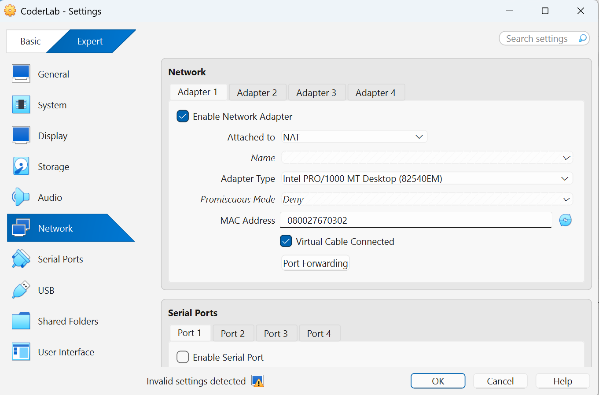
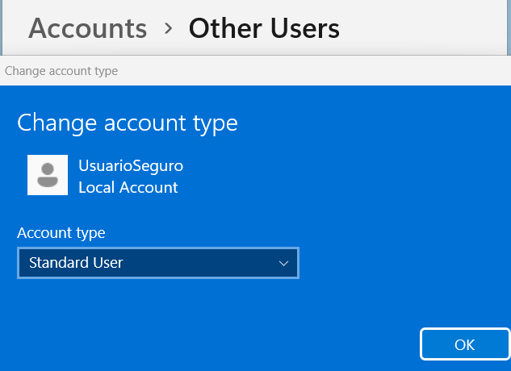
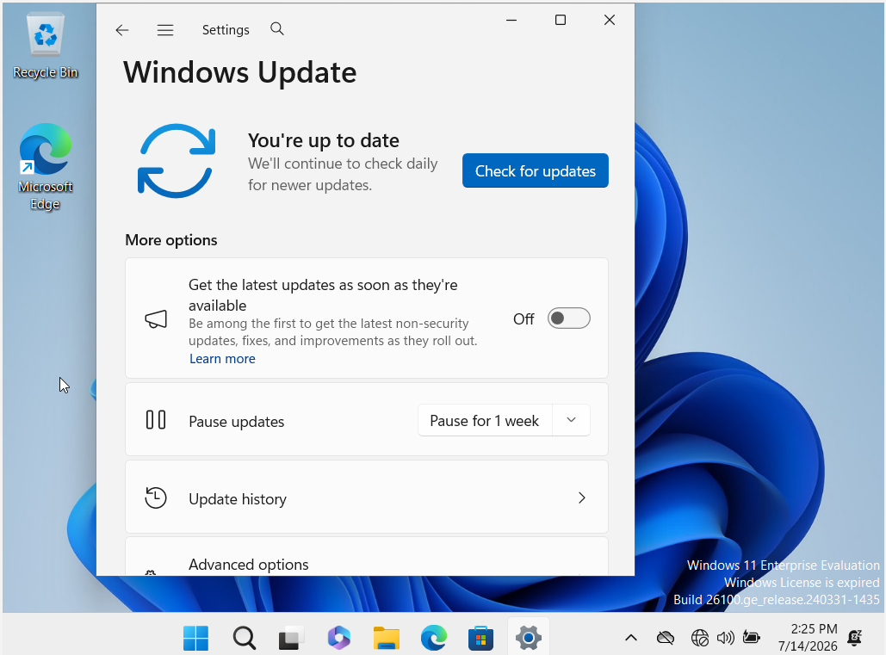
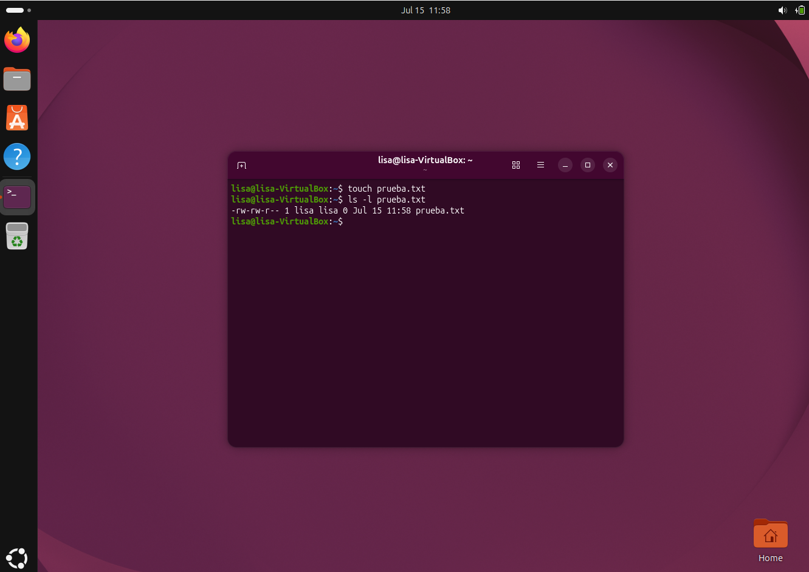
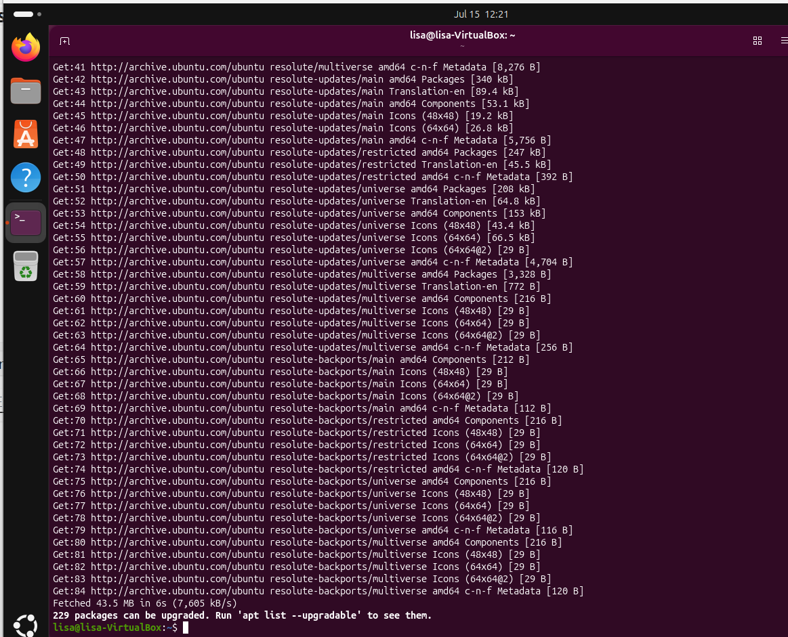
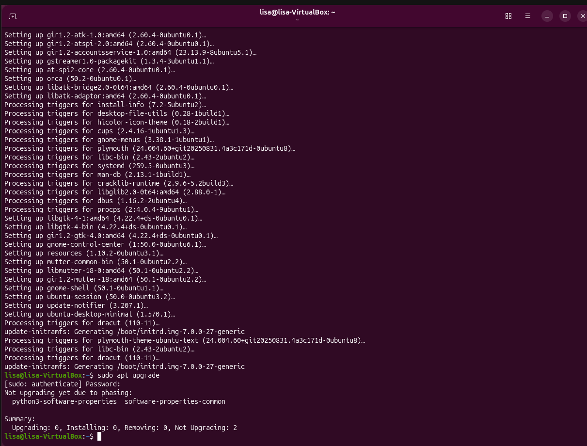
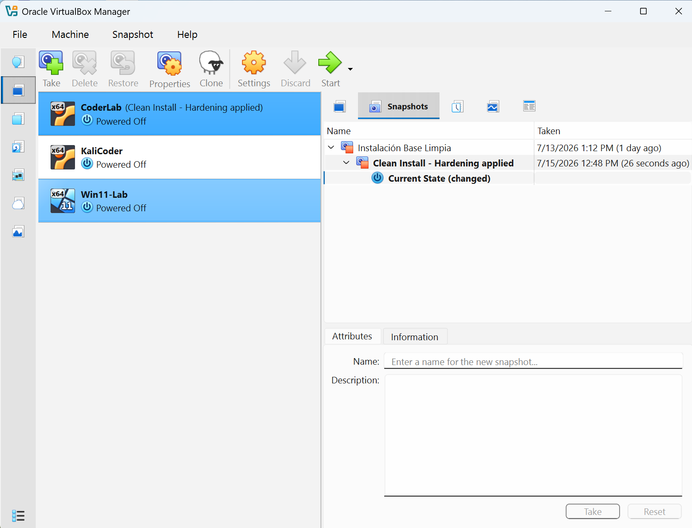

# Reporte Técnico de Configuración de Laboratorio
## Checkpoint: Mi primer laboratorio seguro de ciberseguridad

**Autor:** Lisa-Maria Ubbenjans
**Ejercicio:** Checkpoint — Máquina de Prácticas
**Hipervisor:** Oracle VirtualBox
**Máquina virtual documentada:** CoderLab (Ubuntu Desktop)
**Fecha:** 15 de julio de 2026

---

### Resumen de cumplimiento

| # | Punto de la rúbrica | Evidencia | Estado |
|---|---------------------|-----------|--------|
| 1 | La Fundación: VirtualBox y Red Aislada | Captura de red en modo **NAT** + justificación | ✅ |
| 2 | Capa Windows: Usuarios y Actualizaciones | Usuario **estándar** + **Windows Update** al día | ✅ |
| 3 | Capa Linux: Permisos y Gestión | `ls -l` + `sudo apt update` / `sudo apt upgrade` | ✅ |
| 4 | La Red de Seguridad: Snapshot Inicial | Snapshot **"Clean Install - Hardening applied"** | ✅ |

---

## 1. La Fundación: VirtualBox y Red Aislada

### Configuración realizada

El adaptador de red de la máquina virtual se configuró en modo **NAT**, en
`Configuración > Red > Adaptador 1 > Conectado a: NAT`, **antes** de encender
la máquina por primera vez.



**Datos verificables de la captura:**
- Adaptador 1: `Enable Network Adapter` activado.
- `Attached to / Conectado a:` **NAT**.
- `Adapter Type:` Intel PRO/1000 MT Desktop (82540EM).
- `Promiscuous Mode:` Deny.

### Por qué elegí este modo y cómo protege al Host

Elegí el modo **NAT** porque es el que indica la guía del ejercicio y porque
ofrece el equilibrio correcto para este laboratorio: la máquina virtual **puede
salir a internet** a través del Host (necesario para descargar las
actualizaciones del sistema), pero **no es visible** para los demás
dispositivos de la red doméstica.

En modo NAT, VirtualBox actúa como un router intermedio que traduce las
direcciones: el tráfico de la VM sale hacia internet, pero **nadie puede iniciar
una conexión entrante hacia la VM** desde la red local. Esto protege al equipo
real (Host) porque la máquina virtual queda detrás de esa barrera de traducción
y no expone ningún servicio al exterior.

**Por qué NO usé el modo Puente (Bridged):** el modo Puente convertiría la VM en
un dispositivo más de la red Wi-Fi, con IP propia asignada por el router y
visible para todos los equipos de la casa u oficina. En un laboratorio donde se
instalarán herramientas de prueba y posible software vulnerable, exponer la VM
directamente a la red doméstica es un error de seguridad grave. El modo NAT evita
ese riesgo.

---

## 2. Capa Windows: Usuarios y Actualizaciones

### 2.1 Usuario estándar (principio de menor privilegio)

Se creó la cuenta local **UsuarioSeguro** desde
`Configuración > Cuentas > Otros usuarios`, configurada expresamente como
**Usuario estándar** (*Standard User*), separada de la cuenta de Administrador.



**Datos verificables de la captura:**
- Cuenta: **UsuarioSeguro** — *Local Account*.
- `Account type / Tipo de cuenta:` **Standard User** (no Administrador).

**Por qué es importante:** es el **principio de menor privilegio**. Si el trabajo
diario se realiza con una cuenta limitada, un malware ejecutado bajo ese usuario
no dispone de inmediato de permisos administrativos; el atacante debe superar una
barrera adicional (escalada de privilegios). Trabajar siempre como Administrador
por comodidad es el error número uno del principiante en seguridad.

### 2.2 Sistema actualizado

Se ejecutó **Windows Update** y el sistema confirma el estado **"You're up to
date"** (Está actualizado), sin parches pendientes.



**Dato verificable de la captura:** mensaje **"You're up to date"** en la pantalla
de Windows Update.

**Por qué es importante:** mantener el sistema actualizado cierra los **agujeros
de seguridad conocidos**. La mayoría de los ataques reales no explotan fallos
nuevos, sino vulnerabilidades ya documentadas cuyo parche la víctima nunca
instaló.

---

## 3. Capa Linux: Permisos y Gestión

### 3.1 Permisos de archivo con `ls -l`

Se creó un archivo de prueba y se consultaron sus permisos con `ls -l`:

```bash
touch prueba.txt
ls -l prueba.txt
```

Salida obtenida en la terminal:

```
-rw-rw-r-- 1 lisa lisa 0 Jul 15 11:58 prueba.txt
```



**Lectura del resultado:** la cadena `-rw-rw-r--` se interpreta en tres bloques
de tres caracteres:
- **Propietario** (`lisa`): lectura y escritura (`rw-`).
- **Grupo** (`lisa`): lectura y escritura (`rw-`).
- **Otros usuarios**: solo lectura (`r--`).

Nadie tiene permiso de ejecución (`x`). Los permisos de archivos son la forma más
básica de **control de acceso** en Linux y aplican el mismo principio de menor
privilegio: cada usuario obtiene únicamente los derechos que necesita.

### 3.2 Búsqueda e instalación de actualizaciones

Se actualizó el índice de paquetes y se instalaron las actualizaciones
disponibles usando **`sudo`** (nunca una sesión permanente de root):

```bash
sudo apt update
sudo apt upgrade
```

**`sudo apt update`** — descarga los índices de paquetes (43,5 MB) y detecta
229 paquetes actualizables:



**`sudo apt upgrade`** — tras instalar las actualizaciones, una segunda ejecución
confirma que el sistema está al día:

```
Summary:
  Upgrading: 0, Installing: 0, Removing: 0, Not Upgrading: 2
```



**Por qué es importante:** igual que en Windows, actualizar el sistema corrige
vulnerabilidades conocidas. El uso de **`sudo`** en lugar de `sudo su` es
intencional: los privilegios elevados se solicitan solo para el comando concreto
que los necesita y durante el tiempo mínimo, en lugar de mantener abierta una
sesión de root (evitando así el error #1 del principiante).

---

## 4. La Red de Seguridad: Snapshot Inicial

### Configuración realizada

Con la máquina virtual **apagada**, se creó una instantánea (snapshot) llamada
exactamente **"Clean Install - Hardening applied"** desde el Administrador de
Instantáneas de VirtualBox.



**Datos verificables de la captura:**
- Máquina: **CoderLab** — *Powered Off*.
- Árbol de snapshots: `Instalación Base Limpia` → **`Clean Install - Hardening applied`** → `Current State`.
- Fecha de creación del snapshot: 15/07/2026.

**Por qué es importante:** el snapshot es la **"máquina del tiempo"** del
laboratorio. Congela el estado del sistema limpio y ya endurecido, de modo que
cualquier experimento posterior —instalar una herramienta, ejecutar malware de
prueba o romper una configuración— puede revertirse en segundos con la función
*Restore*. Esto permite experimentar sin miedo, que es precisamente el propósito
de un laboratorio.

---

## Conclusión

El laboratorio queda operativo y protegido en cuatro niveles: la **red** está
aislada mediante NAT, los **usuarios** trabajan con privilegios mínimos tanto en
Windows como en Linux, los **sistemas** están al día frente a vulnerabilidades
conocidas, y existe un **snapshot** que permite revertir cualquier error. En
conjunto, el entorno aplica los dos principios centrales de la seguridad
defensiva: **menor privilegio** y **reducción de la superficie de ataque**,
dentro de un espacio donde equivocarse no tiene consecuencias reales.
